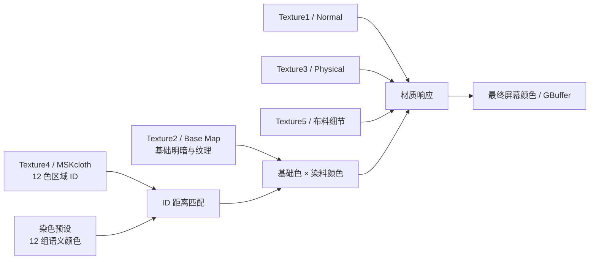
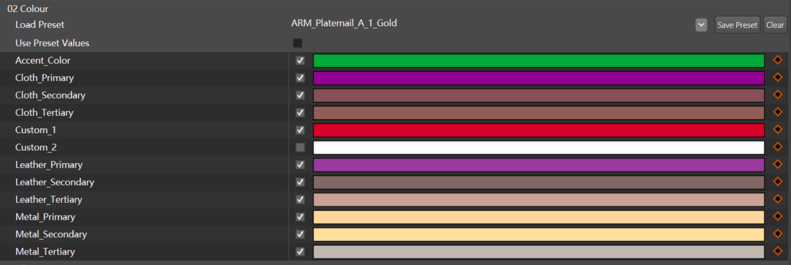
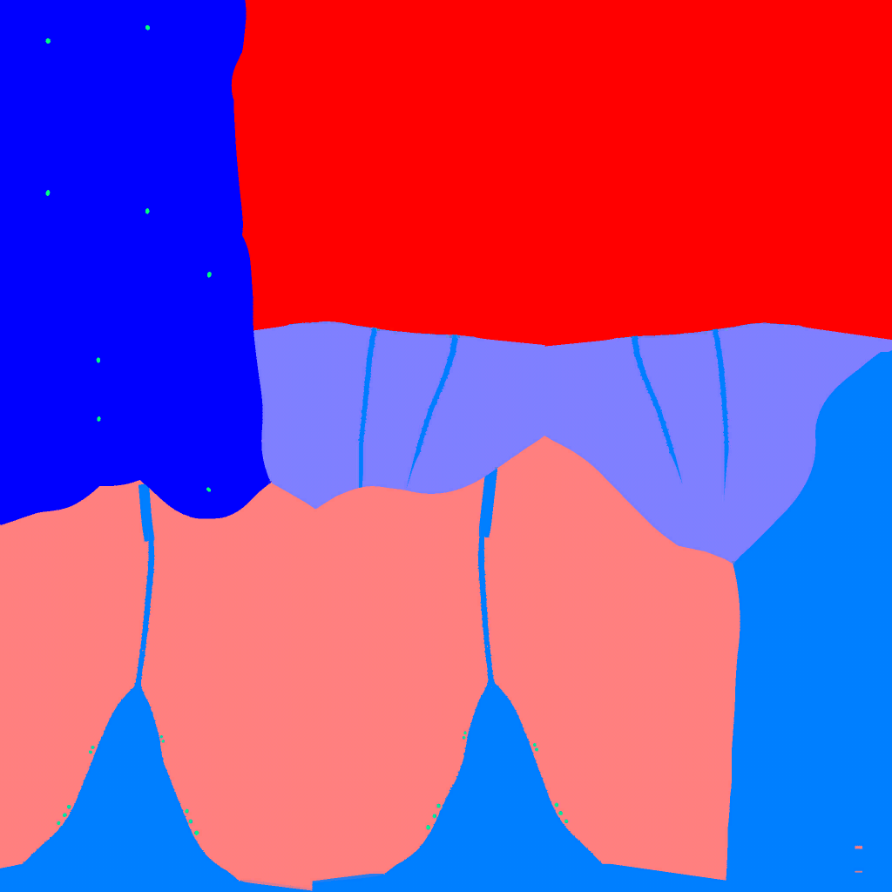

# 《博德之门 3》染色区域逆向说明

> 面向角色 / 服装美术的 `MSKcloth` ID 图制作与检查指南  
> 版本：v1.0（美术会议版）  
> 逆向样本：Baldur's Gate 3，Draw EID 7918，衣服 / 裤装材质  
> 分析环境：RenderDoc 1.46，D3D11  
> 日期：2026-09-02

---

## 1. 会议先讲这五点

1. **Texture4 是染色区域 ID 图。** 它在 BG3 美术管线中对应复杂服装使用的 `MSKcloth`，像素颜色只负责选择染色槽，本身不是最终显示颜色。
2. **每个 RGB 通道只有 3 个逻辑档位：`0 / 0.5 / 1`。** 三个通道组合后形成 12 个有效区域 ID，不是 R、G、B 三张独立灰度遮罩。
3. **12 个 ID 对应固定语义槽。** Cloth、Leather、Metal 各有 Primary / Secondary / Tertiary，再加 Accent、Custom_1、Custom_2。
4. **最终颜色由“基础色 × 染色预设”得到。** 同一染料在不同装备上效果不同，主要因为各装备的 ID 分区、基础色和材质贴图不同。
5. **金属感、粗糙度和 AO 不由染料决定。** 染料修改颜色；Physical Map 和细节贴图继续负责材质质感。

> **一句话结论**  
> Texture4 决定“这块区域跟哪个染色参数走”；染色预设决定“这个参数是什么颜色”；BM / NM / PM 决定“最终看起来是什么材质”。

---

## 2. 运行时染色流程



核心逻辑可简化为：

```hlsl
weight[i] = max(0, 1 - 2.3094 * distance(maskRGB, idRGB[i]));
dyeColor = sum(weight[i] * DyePalette[i]);
tintedBase = Texture2.rgb * dyeColor;
finalColor = ApplyMaterialResponse(tintedBase, Texture1, Texture3, Texture5);
```

EID 7918 中，颜色部分可以进一步还原为：

```hlsl
weight[i] = max(0, (0.25 - distance(maskRGB, idRGB[i]) * 0.577350) * 4.0);
dyeTint = sum(weight[i] * DyePalette[i].rgb);
dyedBase = Texture2.rgb * dyeTint;

// layerWeightA/B 由 Texture3、Texture5 和若干染色参数的 .w 共同生成。
colorA = dyedBase + layerWeightA * (cb1[12].rgb - dyedBase);
finalColor = saturate(colorA + layerWeightB * (cb1[13].rgb - colorA));
```

也就是说，Shader 并非只有一层“底图乘染料色”。它先用 12 个 ID 权重混出
`dyeTint`，再允许两个由材质贴图和细节贴图控制的覆盖颜色层参与最终混合。
`cb1[12]`、`cb1[13]` 是覆盖颜色，不是新的 Texture4 区域 ID。

### 为什么不是直接比较 RGB 是否相等

Texture4 使用 BC1 压缩，运行时还会经过纹理过滤和 mipmap。理论值 `128` 在捕获中可能变成 `126`、`129`、`123` 或 `132`。因此着色器使用 RGB 空间距离做容错匹配，而不是要求像素与 ID 色完全相等。

这同时意味着：

- 硬材质分区应该使用精确 ID 色和平涂边界。
- 软笔刷、抗锯齿、压缩和 mipmap 会生成中间 RGB，并可能让相邻染色槽在边缘混合。
- UV 岛边缘需要足够的同色扩边，避免远处 mip 串色。

---

## 3. 12 个染色区域 ID 速查

> **制作要求**  
> 建议建立团队共享色板、Substance 材质或 Photoshop Swatches。不要从截图、压缩后的 DDS 或 RenderDoc 导出图重新吸色。

| 类别 | 参数名 | ID 色 | 归一化 RGB | 8-bit RGB | Shader 常量 | 美术语义 |
|---|---|---:|---:|---:|---:|---|
| Cloth | `Cloth_Primary` | `#FF8000` | `1, 0.5, 0` | `255, 128, 0` | `cb1[0]` | 布料主色 |
| Cloth | `Cloth_Secondary` | `#FF0000` | `1, 0, 0` | `255, 0, 0` | `cb1[1]` | 布料辅色 |
| Cloth | `Cloth_Tertiary` | `#FF8080` | `1, 0.5, 0.5` | `255, 128, 128` | `cb1[2]` | 布料点缀 |
| Accent | `Accent_Color` | `#FF0080` | `1, 0, 0.5` | `255, 0, 128` | `cb1[3]` | 通用强调色 |
| Leather | `Leather_Primary` | `#8000FF` | `0.5, 0, 1` | `128, 0, 255` | `cb1[4]` | 皮革主色 |
| Leather | `Leather_Secondary` | `#0000FF` | `0, 0, 1` | `0, 0, 255` | `cb1[5]` | 皮革辅色 |
| Leather | `Leather_Tertiary` | `#8080FF` | `0.5, 0.5, 1` | `128, 128, 255` | `cb1[6]` | 皮革点缀 |
| Custom | `Custom_1` | `#0080FF` | `0, 0.5, 1` | `0, 128, 255` | `cb1[7]` | 资产自定义槽 1 |
| Metal | `Metal_Primary` | `#00FF80` | `0, 1, 0.5` | `0, 255, 128` | `cb1[8]` | 金属主色 |
| Metal | `Metal_Secondary` | `#00FF00` | `0, 1, 0` | `0, 255, 0` | `cb1[9]` | 金属辅色 |
| Metal | `Metal_Tertiary` | `#80FF80` | `0.5, 1, 0.5` | `128, 255, 128` | `cb1[10]` | 金属点缀 |
| Custom | `Custom_2` | `#80FF00` | `0.5, 1, 0` | `128, 255, 0` | `cb1[11]` | 资产自定义槽 2 |

### 需要特别注意的两件事

1. 三个通道各有 3 档，数学上可以产生 27 种组合，但 BG3 的复杂服装着色器只定义了上面 12 个颜色锚点。
2. 不要自行使用黑、白、灰或其他未定义 RGB 组合作为“新区域”。它们没有对应的正式染色槽，可能得到零权重、混合权重或不可控结果。

---

## 4. 编辑器参数与 ID 图的关系



_图 1：Colour 参数面板中的色条是染色预设提供的实际颜色，不是 Texture4 应该绘制的 ID 色。_

编辑器常见显示顺序是：

```text
Accent_Color
Cloth_Primary
Cloth_Secondary
Cloth_Tertiary
Custom_1
Custom_2
Leather_Primary
Leather_Secondary
Leather_Tertiary
Metal_Primary
Metal_Secondary
Metal_Tertiary
```

EID 7918 像素着色器中的常量缓冲顺序则是：

```text
cb1[0]   Cloth_Primary
cb1[1]   Cloth_Secondary
cb1[2]   Cloth_Tertiary
cb1[3]   Accent_Color
cb1[4]   Leather_Primary
cb1[5]   Leather_Secondary
cb1[6]   Leather_Tertiary
cb1[7]   Custom_1
cb1[8]   Metal_Primary
cb1[9]   Metal_Secondary
cb1[10]  Metal_Tertiary
cb1[11]  Custom_2
```

> **给 TA / 工具开发的提醒**  
> 重建 Blender、Unreal、Substance 或离线烘焙工具时，必须按语义名或 ID 色映射。不要假定编辑器 UI 行号等于 constant buffer 下标。

---

## 5. 逆向案例：EID 7918 裤装



_图 2：EID 7918 的 Texture4。大面积为离散色块，边缘少量中间值来自压缩、过滤、抗锯齿或原始绘制。_

### 5.1 实际使用区域

| ID 色 | 对应语义槽 | 像素覆盖率 | Shader 常量 | 本帧染料颜色（近似 sRGB） |
|---:|---|---:|---:|---|
| `#FF8080` | `Cloth_Tertiary` | 29.77% | `cb1[2]` | 蓝灰 `#5D6B7E` |
| `#FF0000` | `Cloth_Secondary` | 27.14% | `cb1[1]` | 棕色 `#7C563A` |
| `#0000FF` | `Leather_Secondary` | 15.74% | `cb1[5]` | 土黄 `#9A7B63` |
| `#0080FF` | `Custom_1` | 15.57% | `cb1[7]` | 橄榄绿 `#6C6F33` |
| `#8080FF` | `Leather_Tertiary` | 11.55% | `cb1[6]` | 深棕 `#66402F` |
| `#00FF80` | `Metal_Primary` | 0.032% | `cb1[8]` | 金色 `#FFC97D` |

覆盖率采用“将实际 BC1 像素量化到最近的 `0 / 128 / 255` 档位”统计。剩余约 0.2% 主要是边缘和压缩产生的过渡组合。

### 5.2 案例结论

这条裤子虽然视觉上属于服装，但区域没有只使用 Cloth：

- 主要区域使用 `Cloth_Secondary` 和 `Cloth_Tertiary`。
- 次要区域使用 `Leather_Secondary`、`Leather_Tertiary`。
- 一个大区域使用 `Custom_1`。
- 极少量细节使用 `Metal_Primary`。

因此，`Cloth / Leather / Metal` 更像**染色语义接口**，不是对实际表面材质类型的强制分类。美术可以把任意造型区域接到任意槽，但需要考虑所有染料预设对该槽的定义是否稳定。

### 5.3 ID 色和最终颜色为什么完全不同

以红色 ID 为例：

```text
Texture4 像素：#FF0000
→ 识别为 Cloth_Secondary
→ 本帧读取 cb1[1]
→ 线性颜色约为 (0.2000, 0.0939, 0.0419)
→ 显示空间近似 #7C563A
→ 再乘 Texture2 基础色并进入材质响应
```

所以红色 ID 最后显示为棕色是正常行为；红色只是编号，不是染料。

---

## 6. Texture0–Texture5 的职责

EID 7918 中，Texture1、Texture2、Texture3 在绑定层面指向同一个大型 BC3 虚拟纹理物理图集。着色器通过 Texture0 页表、结构化元数据以及不同采样路径读取图集中的不同材质层。

| 纹理槽 | 逆向角色 | 判断依据 | 对美术的影响 |
|---|---|---|---|
| Texture0 | 虚拟纹理页表 | 解码物理图集页坐标 | 不是直接制作的材质图 |
| Texture1 | Normal / NM | 采样后重映射到 `-1~1` 并参与法线空间转换 | 控制表面凹凸与受光 |
| Texture2 | Base Map / BM | RGB 进入最终基础色乘法 | 控制固有明暗、纹理及染色基础 |
| Texture3 | Physical / PM | 参与金属、粗糙及其他材质遮罩运算 | 控制金属感、光泽、AO 等 |
| Texture4 | MSKcloth ID | 与 12 个 RGB 锚点做距离匹配 | 决定像素读取哪个染色槽 |
| Texture5 | 布料 / 微表面细节 | 驱动细节尺度和部分材质响应 | 补充织物、微结构等质感 |

BG3 官方制作文档对常规 Physical Map 的通道定义为：

```text
R = Metalness
G = Roughness
B = Ambient Occlusion
```

不同材质 shader 变体仍可能加入额外阈值、覆盖色或细节逻辑，因此这里不把 EID 7918 的所有临时寄存器强行命名为固定美术通道。

### 6.1 `virtualTextureMetadata` 是什么

它是绑定在 `t125` 的结构化缓冲，每个元素占 `128` 字节（`32` 个 `uint`）。
它不存放颜色或染色 ID，而是告诉 Shader 如何从 Texture0 页表定位
Texture1–Texture3 大图集中的物理页。EID 7918 实际读取的区间已经整理为：

- `words[1..4]`：LOD 与导数缩放参数。
- `words[8..9]`：物理页尺度。
- `words[12..15]`：图层 / 页描述和有效页标记。
- `words[16..19]`：Base Color 图集缩放与偏移。
- `words[20..23]`：Normal 图集缩放与偏移。
- `words[24..27]`：Physical 图集缩放与偏移。

这些名称来自本次捕获中的使用方式，不代表 Larian 官方结构体字段名。整理版
Shader 使用具名读取函数，但刻意保留了原始 word 下标、重复读取和运算顺序。

---

## 7. 美术制作工作流

### 7.1 区域规划

1. 按造型和换色需求规划主布、辅布、皮革、金属、点缀以及 Custom 区域。
2. 先确认每个语义槽在项目染料预设中的典型颜色范围，再决定区域归属。
3. 不要只按“看起来是什么材质”机械选择槽；也要考虑染色设计需要。
4. 避免把大面积关键区域放进没有稳定预设覆盖的 Custom 槽，除非团队已有明确规范。

### 7.2 ID 图绘制

1. 在 UV 模板上使用第 3 节的精确 ID 色平涂。
2. 硬材质边界使用硬边画笔，避免无意的半透明、抗锯齿和色彩混合。
3. UV 岛边缘进行足够的同色扩边 / dilation。
4. 不要使用颜色校正、色相偏移、曲线、锐化等会改变 ID 数值的后处理。
5. 导出前检查图中是否存在未定义颜色组合。

### 7.3 基础色与材质贴图

1. 需要广泛换色的 BM 区域应保留清晰明暗和纹理，但避免烘焙过强的固有色。
2. 金属度、粗糙度和 AO 在 PM 中单独设计，不要指望 `Metal_Primary` 颜色自动产生金属效果。
3. NM、PM 与 ID 区域边界需要在视觉上互相支持。例如金属 ID 区域若 PM 仍为布料响应，最终仍会像布。

### 7.4 引擎验证

1. 先套用“诊断染色预设”：12 个槽全部使用明显不同的颜色。
2. 检查漏填、错接、相邻区域串色和 Custom 回退。
3. 再测试至少三类实际染料：深色、浅色、高饱和色。
4. 在近景、远景 mip、不同光照、潮湿效果和角色动作下检查。

---

## 8. 常见问题与处理

| 现象 | 优先检查项 |
|---|---|
| 边缘出现脏色或意外渐变 | 软笔刷、抗锯齿、UV 扩边、BC1 压缩、mipmap |
| 同一染料在两件装备上差异巨大 | 两件资产的 ID 分区、BM 固有色和 PM 响应 |
| Metal 槽看起来仍像布 | PM 的 Metalness / Roughness；槽名不会自动改变物理材质 |
| Custom 区域没有预期颜色 | 染料预设是否定义 Custom_1 / Custom_2；默认回退色是什么 |
| 从导出图吸色后区域错判 | 是否从 BC 压缩或显示空间图像吸色；重新使用精确色板 |
| 远处出现区域串色 | mipmap、UV 岛间距、padding 和 ID 边界 |
| 染色后整体过暗或颜色偏脏 | BM 是否带有过强固有色；染料颜色是否在线性空间参与乘法 |
| 同一区域不同像素染色不一致 | ID 图内是否存在未定义 RGB、中间色或压缩伪影 |

---

## 9. 资产提交前检查清单

### ID 图

- [ ] 所有区域均使用 12 个合法 ID 之一。
- [ ] 不存在误用黑、白、灰或其他未定义组合。
- [ ] 硬边与软过渡均为有意设计，而不是画笔或压缩副作用。
- [ ] UV 岛边缘具有足够的同色扩边。
- [ ] 远处 mip 没有相邻区域串色。

### 材质配合

- [ ] Cloth / Leather / Metal 被当作调色语义接口，而不是自动材质分类。
- [ ] BM、NM、PM 与 ID 图职责分离。
- [ ] 金属度、粗糙度和 AO 没有通过染料颜色硬凑。
- [ ] Custom_1 / Custom_2 的预设覆盖与回退行为已经确认。

### 引擎验证

- [ ] 使用 12 色诊断染料验证全部已用槽。
- [ ] 使用深色、浅色、高饱和染料完成最终观感检查。
- [ ] 检查近景、远景、不同光照和角色动作。
- [ ] 确认 UI 参数名、工具映射与 shader 常量顺序没有错位。

---

## 10. 建议会议上确认的问题

1. 项目是完整复刻 BG3 的 12 槽系统，还是只保留实际需要的子集？
2. 谁负责定义区域语义：角色概念、美术资产、材质美术还是 TA？
3. `Custom_1 / Custom_2` 是否允许资产自由使用，还是保留给特殊装备规则？
4. 团队是否需要统一的 Photoshop / Substance 色板与诊断染料预设？
5. 是否开发自动检查工具，扫描非法 RGB、边缘中间色和 padding 风险？
6. ID 图的压缩格式、色彩空间、mipmap 与导入预设采用哪套项目规范？
7. 是否需要在 DCC 中提供与 BG3 一致的 12 槽实时预览节点？

---

## 11. 证据范围与置信度

### 高置信结论

- Texture4 是 EID 7918 的染色区域 ID 图。
- 着色器中存在 12 个固定 RGB 颜色锚点。
- 12 个锚点分别读取 `cb1[0]` 到 `cb1[11]`。
- Texture1、Texture2、Texture3 分别沿法线、基础色、材质参数路径参与运算。
- EID 7918 的主要 ID 区域、覆盖率和本帧染料常量已从实际 GPU 捕获中提取。

### 解释性结论

- Texture3 的 PM 通道命名结合 BG3 官方制作文档解释。
- Texture5 可确定为布料 / 微表面和附加材质响应，但未把所有分量强行命名为固定管线字段。
- BG3 其他 shader 变体可能存在简化的 `MSK`、额外颜色槽、顶点色遮罩或不同覆盖逻辑。

> 本文是基于 GPU 捕获的逆向研究与美术制作参考，不代表 Larian 官方内部 shader 源码、参数命名或完整引擎实现。

---

## 12. 参考资料与逆向产物

- Larian Studios，《Creating Armour》：<https://docs.baldursgate3.game/Creating_Armour>
- RenderDoc 捕获：`D:\Capture\BG3\handSSSS.rdc`
- 分析事件：Draw EID `7918`
- 可读 Shader：`shaders/eid_7918_ps_readable_vt_organized.hlsl`
- 会议用 Texture4 图：`docs/assets/eid_7918_texture4_id_mask.png`

---

## 附录 A：EID 7918 的 12 组染料常量

下列 RGB 来自本帧 `cb1[0..11]`。数值为 shader 运算使用的线性颜色；Hex 是为了会议理解而做的近似 sRGB 显示值，并不等于最终屏幕颜色。

| cb | 语义槽 | 线性 RGB | 近似 sRGB |
|---:|---|---|---:|
| `cb1[0]` | `Cloth_Primary` | `0.2185, 0.2852, 0.1793` | `#819175` |
| `cb1[1]` | `Cloth_Secondary` | `0.2000, 0.0939, 0.0419` | `#7C563A` |
| `cb1[2]` | `Cloth_Tertiary` | `0.1087, 0.1467, 0.2097` | `#5D6B7E` |
| `cb1[3]` | `Accent_Color` | `0.3642, 0.1396, 0.1166` | `#A36860` |
| `cb1[4]` | `Leather_Primary` | `0.3412, 0.1599, 0.1097` | `#9E6F5D` |
| `cb1[5]` | `Leather_Secondary` | `0.3240, 0.1986, 0.1242` | `#9A7B63` |
| `cb1[6]` | `Leather_Tertiary` | `0.1339, 0.0515, 0.0289` | `#66402F` |
| `cb1[7]` | `Custom_1` | `0.1489, 0.1586, 0.0331` | `#6C6F33` |
| `cb1[8]` | `Metal_Primary` | `1.0000, 0.5826, 0.2058` | `#FFC97D` |
| `cb1[9]` | `Metal_Secondary` | `0.7686, 0.7686, 0.7686` | `#E3E3E3` |
| `cb1[10]` | `Metal_Tertiary` | `0.7686, 0.7686, 0.7686` | `#E3E3E3` |
| `cb1[11]` | `Custom_2` | `1.0000, 1.0000, 1.0000` | `#FFFFFF` |

`cb1[*].w` 还参与后续材质阈值或响应计算，不应简单理解为透明度。`cb1[12]` 和 `cb1[13]` 是额外覆盖颜色，不属于上面的 12 个区域槽。
