# Vulkan渲染流程图 - vulkan.rdc

## 整体统计
- **API**: Vulkan
- **总操作数**: 1,515
- **Draw Calls**: 1,162
- **Compute Dispatches**: 126
- **Clear操作**: 8
- **Copy操作**: 20
- **Present**: 1
- **Markers**: 55

## 资源统计
- **纹理**: 704
- **缓冲区**: 726

---

## 渲染Pass流程图

```mermaid
graph TD
    Start[Frame Start] --> CopyPass1[Copy/Clear Pass #1<br/>9 ops]

    CopyPass1 --> ComputePass1[Compute Pass #1<br/>94 dispatches]

    ComputePass1 --> CopyPass2[Copy/Clear Pass #2<br/>5 ops]

    CopyPass2 --> DepthPass1[Depth-only Pass #1<br/>193 draws]
    DepthPass1 --> ColorPass1[Colour Pass #1<br/>1 Target, 3 draws]

    ColorPass1 --> DepthPass2[Depth-only Pass #2<br/>193 draws]
    DepthPass2 --> ColorPass2[Colour Pass #2<br/>1 Target, 3 draws]

    ColorPass2 --> DepthPass3[Depth-only Pass #3<br/>35 draws]
    DepthPass3 --> ColorPass3[Colour Pass #3<br/>1 Target, 3 draws]

    ColorPass3 --> DepthPass4[Depth-only Pass #4<br/>39 draws]
    DepthPass4 --> ColorPass4[Colour Pass #4<br/>1 Target, 3 draws]

    ColorPass4 --> CopyPass3[Copy/Clear Pass #3<br/>7 ops]

    CopyPass3 --> DepthPass5[Depth-only Pass #5<br/>217 draws]
    DepthPass5 --> ColorPass5[Colour Pass #5<br/>5 Targets + Depth<br/>202 draws]

    ColorPass5 --> ColorPass6[Colour Pass #6<br/>1 Target, 3 draws]
    ColorPass6 --> ColorPass7[Colour Pass #7<br/>1 Target + Depth<br/>3 draws]

    ColorPass7 --> CopyPass4[Copy/Clear Pass #4<br/>4 ops]

    CopyPass4 --> ColorPass8[Colour Pass #8<br/>4 Targets + Depth<br/>28 draws]

    ColorPass8 --> PostProcess[后处理阶段]

    PostProcess --> ColorPass9[Colour Pass #9-13<br/>多个单目标Pass]
    ColorPass9 --> ComputePass2[Compute Pass #2-3<br/>23 dispatches]

    ComputePass2 --> ColorPass14[Colour Pass #14<br/>1 Target + Depth<br/>58 draws]
    ColorPass14 --> ColorPass15[Colour Pass #15-16<br/>深度测试Pass]

    ColorPass15 --> ComputePass4[Compute Pass #4-5<br/>7 dispatches]

    ComputePass4 --> FinalPasses[最终合成阶段]

    FinalPasses --> ColorPass17[Colour Pass #17-29<br/>多个后处理Pass]
    ColorPass17 --> CopyPass5[Copy/Clear Pass #5<br/>6 ops]

    CopyPass5 --> ColorPass30[Colour Pass #30-31<br/>UI/叠加层<br/>47 draws]
    ColorPass30 --> ColorPass32[Colour Pass #32-36<br/>最终输出Pass]

    ColorPass32 --> ColorPass37[Colour Pass #37<br/>1 Target + Depth<br/>126 draws]
    ColorPass37 --> CopyPass6[Copy/Clear Pass #6-7<br/>8 ops]

    CopyPass6 --> ColorPass38[Colour Pass #38<br/>最终输出<br/>3 draws]

    ColorPass38 --> Present[Present<br/>显示到屏幕]

    Present --> End[Frame End]

    style Start fill:#90EE90
    style Present fill:#FFB6C1
    style End fill:#87CEEB
    style DepthPass1 fill:#FFE4B5
    style DepthPass2 fill:#FFE4B5
    style DepthPass5 fill:#FFE4B5
    style ColorPass5 fill:#FFA07A
    style ColorPass8 fill:#FFA07A
    style ComputePass1 fill:#DDA0DD
    style ComputePass2 fill:#DDA0DD
```

---

## 渲染阶段分析

### 1️⃣ 初始化阶段
- **Copy/Clear Pass #1**: 缓冲区初始化
- **Compute Pass #1**: 94次计算调度（可能是粒子系统、物理模拟等）

### 2️⃣ 几何渲染阶段
- **4组深度预Pass + 颜色Pass**:
  - Depth Pass #1-4: 总计460次深度绘制
  - 每组后跟随颜色渲染
  - 可能用于阴影贴图或深度预处理

### 3️⃣ 主渲染阶段
- **Depth Pass #5**: 217次深度绘制
- **Colour Pass #5**: 5个渲染目标 + 深度，202次绘制
  - 这是主要的几何渲染阶段（可能是延迟渲染的G-Buffer）

### 4️⃣ 光照与效果阶段
- **Colour Pass #8**: 4个目标 + 深度，28次绘制
  - 可能是光照计算或特效合成

### 5️⃣ 后处理阶段
- **Colour Pass #9-13**: 多个单目标Pass（可能是Bloom、色调映射等）
- **Compute Pass #2-3**: 23次计算（可能是屏幕空间效果）
- **Colour Pass #14**: 58次绘制（可能是透明物体或粒子）

### 6️⃣ 最终合成阶段
- **Colour Pass #17-29**: 13个后处理Pass
- **Colour Pass #30-31**: UI和叠加层渲染（47次绘制）
- **Colour Pass #32-37**: 最终输出准备（包含126次绘制的大型Pass）

### 7️⃣ 输出阶段
- **Colour Pass #38**: 最终输出（3次绘制）
- **Present**: 显示到屏幕

---

## 性能热点

根据操作数量，以下是可能的性能热点：

1. **Depth-only Pass #5** (217 draws) - 深度预处理
2. **Colour Pass #5** (202 draws) - 主几何渲染
3. **Depth-only Pass #1-2** (193 draws each) - 阴影贴图？
4. **Colour Pass #37** (126 draws) - 最终场景合成
5. **Compute Pass #1** (94 dispatches) - 计算密集型操作

---

## 渲染管线特征

这个Vulkan应用使用了典型的**延迟渲染管线**：

- ✅ 多个深度预Pass（阴影/遮挡）
- ✅ G-Buffer渲染（多渲染目标）
- ✅ 计算着色器（后处理/粒子）
- ✅ 多层后处理链
- ✅ UI叠加层
- ✅ 大量的Pass分离（利于调试和优化）
